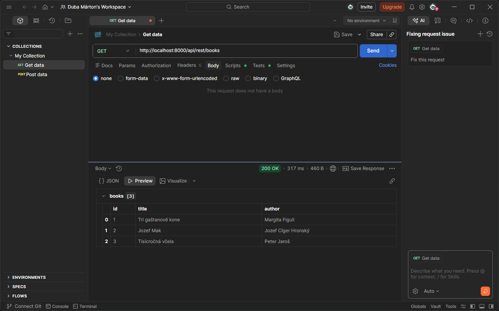
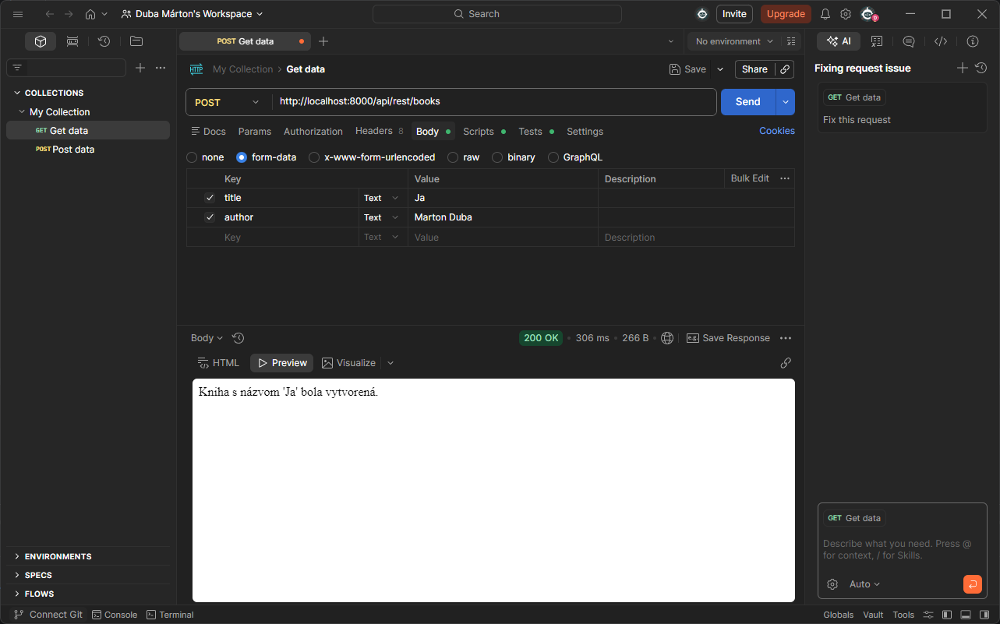
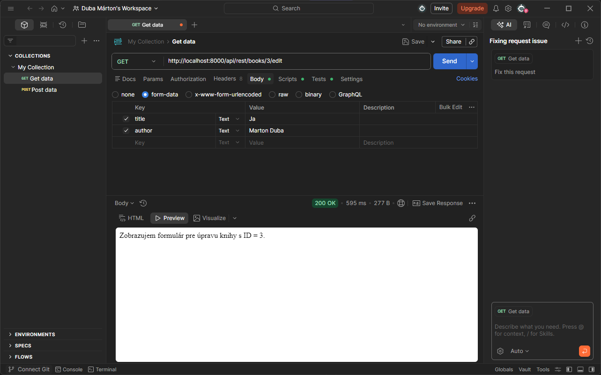
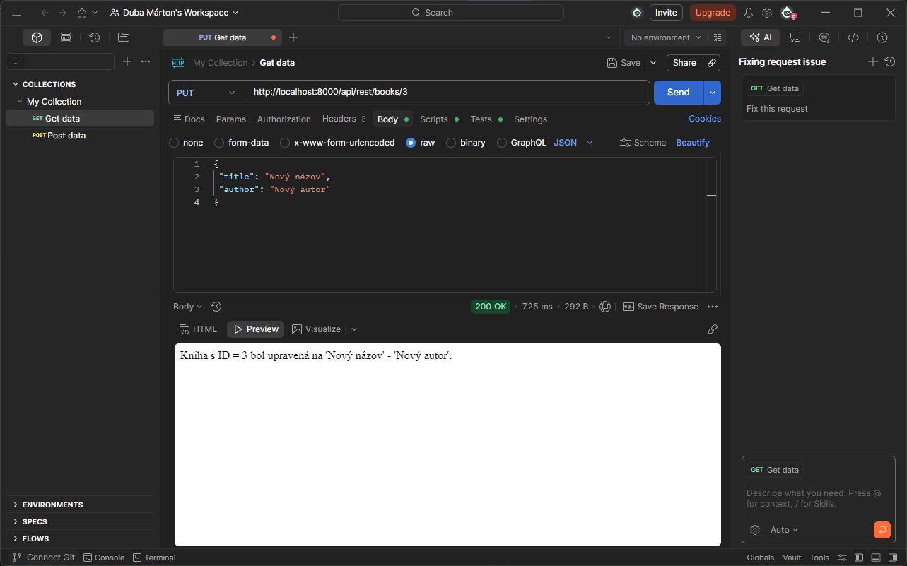
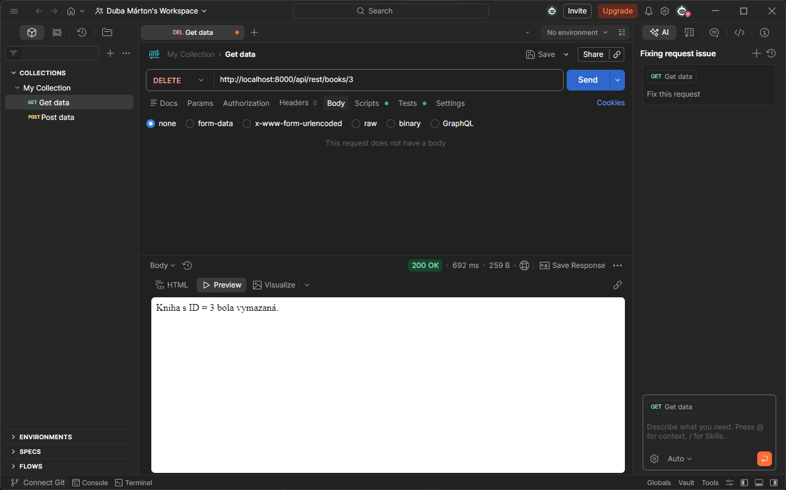
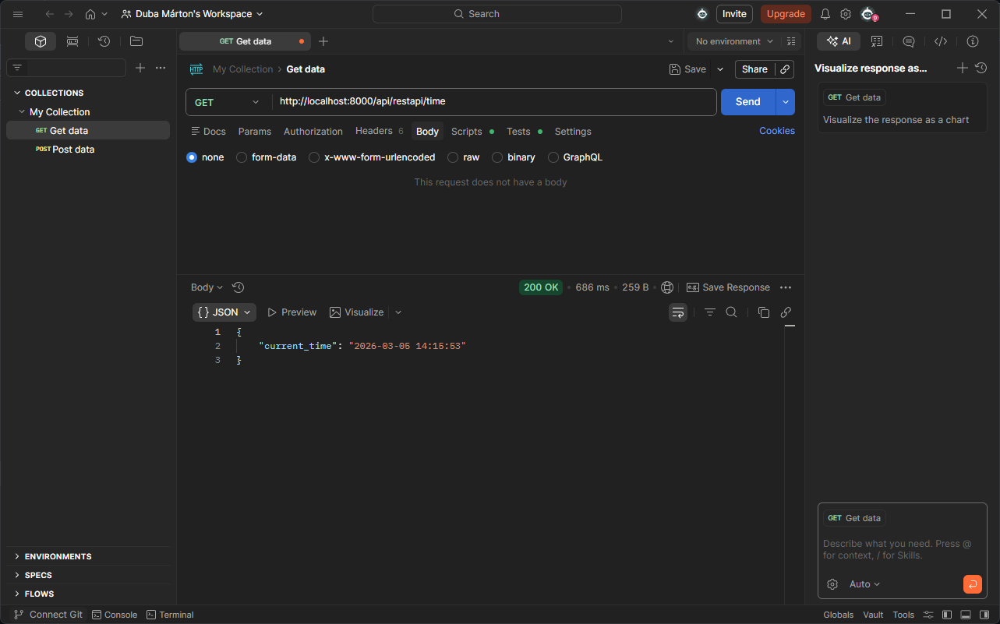
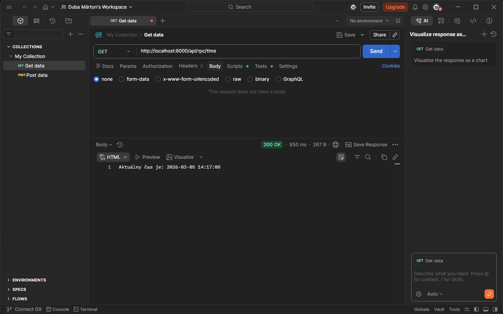

# Laravel REST API – Books

Projekt obsahuje implementáciu REST controlleru pre knihy.

## GET /rest/books

Zobrazenie všetkých kníh.

## POST /rest/books

Vytvorenie novej knihy.

## GET /rest/books/{id}

Zobrazenie jednej knihy.

## GET /rest/books/{id}/edit

Edit formulár.

## PUT /rest/books/{id}

Úprava knihy.

## DELETE /rest/books/{id}

Vymazanie knihy.

Uloha:

## restapi/time

## rpc/time

